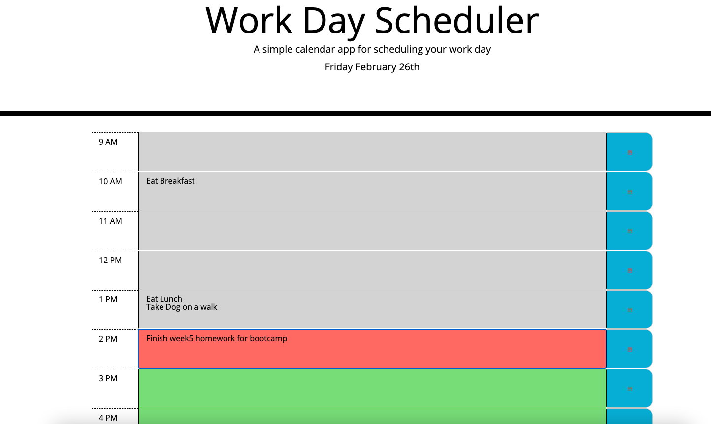
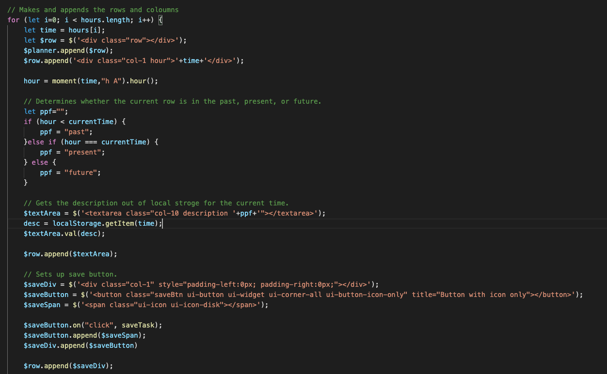

# work-day-scheduler

# Work Day Scheduler
Link: [Work Day Scheduler](https://clairephillips51.github.io/work-day-scheduler/)

## Summary
Using javascript, jQuery, jQuery UI, and bootstrap to make a day planner that will allow you to type in and save tasks for a certain hour of the work day. The sheculer will also update thoughout the day and is color coded so that the current hour is red, any past hour is gray, and any future hour will appear as green.   

## Table of Contents
1. [Process](#process)
2. [Usage](#usage)
3. [What I Learned](#what-i-learned)
4. [Resources](#resources)

## Process
This project started with a skeleton html file and a complete css file. I had to add and write a javascript file. I also added a jQuery UI link and script to the html file so that I could access jQuery UI elements. 

Most of the coding was setting up the script.js file. I fist made a for loop that created 9 rows and 3 columns which I then appended to the container `
` to set up the main structure of the planner. The for loop allowed me to make 27 elemnets without having to type it all out in the htmlf file. 

Next was setting up moment.js to show the current date in the jumbotron. That was simpling setting a variable called "currentDay" and having it equal to moment() then setting the format to ('dddd MMMM Do'). Then having the ID currentDay set to the text of the created varibale show it would show up at the top of the page. Moment.js was also used to determine whether the hour in the planner was past, present, or future to the current hour of the day. 

jQuery UI was used to set a save button in the last column. The save button was turned into an eventlistener so that when clikced the time and the text in the textarea would be saved to local storage. 

## Usage
The work scheduler is set up to follow the current hour of the day. It starts at 9AM and goes to 5PM. 

## What I Learned
This project was daunting at first thinking about how to tackle the entire process of getting a random output was too confusing. I turned it into a step by step approach and did the easy things first. 
I set up the arrays for the letters, numbers, and special characters. Then I wrote the functions that would trigger the prompts for the user to click through.
I then wrote and re-wrote (cried a little) the function used to generate the password output. This took the most time and plenty of research. I did get good practice for writing methods and also used a few while loops in the choice prompt functions. We had not gone indepth about this in class but when researching loops the while loop was better to use to track that the value input for the string length was in fact an integer and not a string. 
I also learned more about the usage of adding EventListeners and connecting them to specific html tags (the buttons in this case). 

## Resources
* [Local Storage)](https://www.w3schools.com/jsref/prop_win_localstorage.asp)
* [Bootstrap grid system](https://getbootstrap.com/docs/4.5/layout/grid/)
* [jQuery UI save button Icon Code](https://jqueryui.com/button/#icons)
* [Moment.js Docs](https://momentjs.com/docs/#/displaying/) 
